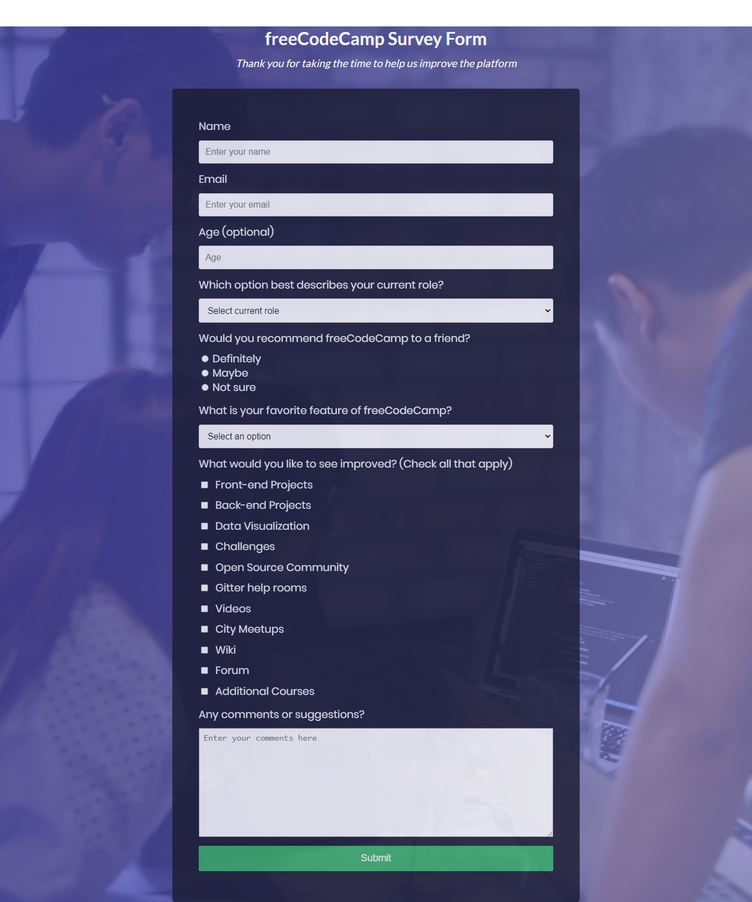

# Building Responsive Design -- Free Code camp Survey Form

> This project, consists of building a responsive website. By be following the free code camp user stories.
[Build a Survey Form](https://codepen.io/freeCodeCamp/full/VPaoNP)

Additional description about the project and its features.

## Built With

- HTML,
- CSS
## Live Demo

[Open Live Demo](https://rawcdn.githack.com/keddo/FCCSurveyForm/13f36df4deb121a484a312de00bacd117c76e3df/index.html)

## Getting Started

**Clone the project to you local machine run index file**

### Setup
> Clone the project into you directory and open it.

## Authors

👤 **Kedir**

- Github: [@keddo](https://github.com/keddo)
- Twitter: [@kedirman](https://twitter.com/kedirman)
## 🤝 Contributing

Contributions, issues and feature requests are welcome!

Feel free to check the [issues page](issues/).

## Show your support

Give a ⭐️ if you like this project!

## Acknowledgments

- Hat tip to anyone whose code was used
- Inspiration
- etc

## 📝 License

This project is [MIT](lic.url) licensed.